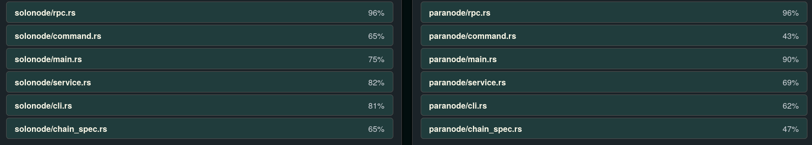

There was an idea according to which we could keep only one node implementation to streamline our processes.
I've taken a look at the situation, read some code and written up some of my (and Wigy's) thoughts:

## Similarity of the implementations

The heavy lifting is done by our dependencies. Our code merely orchestrates Cli interactions and service configuration.

The main divergence between the parachain and solochain nodes is the service configuration and usage of implementations from the `cumulus_*` family of crates rather than the 'regular' `sc_*` crates.

The overlap in my opinion is about 50-60% which I have confirmed with a [plagiarism detection tool](https://jplag.github.io/JPlag/):

I have not uploaded the full report here, but I can make it available upon request.

The benefit of combining the two implementatios would be to remove this code duplication and potentionally
make it easier to maintain **in the future.**

## Disadvantages

- It would take some time to combine nodes. The process could not be mindless as we need to take great care to preserve functionality.
- Breaking conventions: a goal of the polkadot ecosystem is for nodes to have similar cli interfaces and mechanisms. To my knowledge there isn't a node which can run both a solochain and a parachain.
- Node functionality would be split: currently I see no way of seemlessly and reliably detect the mode to run in (could be done by checking the chain's id or name, but...).
  - We would probably have an iterface like this:
    - Solochain: `mosaic-chain solo --validator --chain solochain.json ...`
    - Parachain: `mosaic-chain para --collator --chain parachain.json ...`
  - Having seperate binaries would be just as good.
- It would not make going from solochain to parachain easier for the user: the node needs to be restarted with a new configuration with a new base directory. Potentionally other packages would need to be in the know of this change as well. If we automate this process for the user we can do so with a debian package that deploys scripts making the change. In this case having only one node makes little to no difference.
- Upgrading to new substrate version: as long as we keep our code clode to the official templates we can just apply the diffs on version upgrade. If we customise and refactor too much the process will become less smooth. (Note: we will diverge from template in not having baked in chain spec and runtime)

## Decision

I don't think merging the nodes is a good move for us **now**. The only notable advantage would be less code duplication, but this likely wouldn't make development easier (eg.: upgrading to new substrate version).
It'd give us more control over the code, but at the cost of actually having to maintain it.

I do think, however that at a later time when the need arises and we have the bandwith it might be worth reconsidering.
