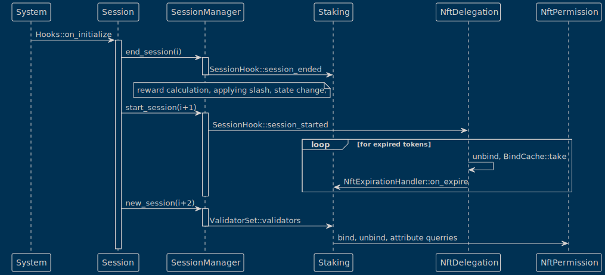
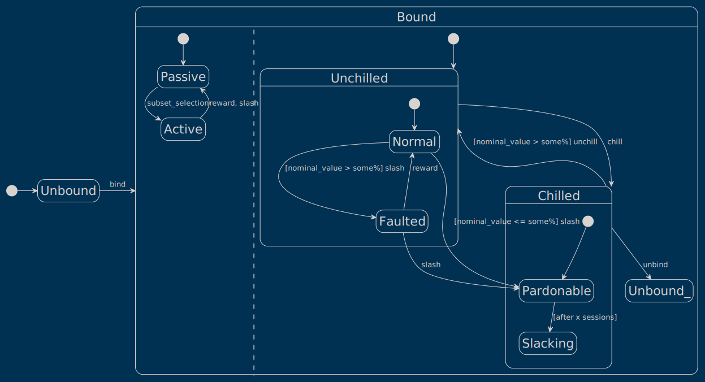

# Staking API

## Design principles

- Least suprise for the end user
- "Strict API" - no soft failures:
  - A call either succeeds according to the provided paramaters or it fails.
- API is primarily for the dev, secondarily for the end user
  - API should be easy to implement and maintain
  - It should be high level enough to enable freedom of impementation and should be easy to test
  - It should be ergonomic for the fronted devs.
  - We'll provide a frontend with good UX for the end users.

## Definitions

- **Staking / delegation:**
  - I'll refer to all amounts as "stake" and the act of modifying stake as "staking" and "unstaking".
  - If the caller and the target accounts differ we can call staking "delegation" and unstaking "undelegation".
  - We wish to treat delegations and "self-staking" similarly, usually the same rules should apply.

- **Contract:** a contract encapsulates the terms of a staking agreement between accounts.
  - There is at most **one** contract per validator-staker pair.
  - Terms: staked amount, minimum staking period and commission rate.
  - The terms do not change if the contract is untouched.
  - The current terms set by the validator are applied every time an amount is added to the stake.
    - These new terms become active at the begginning of the next session.
    - The start of the new staking period is also reset to the upcoming session.

- **Binding / unbinding:**
  - In case of permission NFTs:
    - By binding the validator commits to being online, producing blocks, and taking part in consensus.
    - While an nft is bound it cannot be sold, and it's nominal value can be slashed as a punishment for misbehaviour
    - A validator can undbind if:
      - the validator chilled first
      - the validator is not selected for the current or the upcoming active set
      - doesn't have a binding contract where the minimum staking period is not over
  - In case of delegator NFTs:
    - By binding the delegator delegates the NFT to the chosen validator in exchange for reward proportional to it's nominal value
    - It's nominal value can be slashed if the validator misbehaves
    - Delegator NFTs can also expire in which case they'll be automatically unbound
    - After the minimal staking period ends on a contract these nfts can also be manually unbound.

- **Chilling / Unchilling:**
  - A validator can indicate they wish to be left out of the active set and unbind in the future.
  - Chilled validators can be slashed if they are still chosen active in the current or next session
  - If a validator is chilled for a certain amount of time the delegators have the right to undelegate before their minimum staking period ends.
  - Validator are chilled automatically if they are punished in two consecutive sessions or their permission NFT is slashed below a certain point.
  - Validators can unchill only if their nft's nominal value is above a certain amount (they are not disqualified).

## Constants

- **SlackingPeriod:** number of sessions after which delegators can unstake from a chilled validator
- **NominalValueThreshold:** if the nominal value falls below this percentage of the initial nominal value, the permission NFT gets disqualified.
- **MinimumStakingPeriod:** the default minimum staking period under which a validator can't set their own term.
- **MinimumCommissionRate:** the default commission rate (percentage) under which a validator can't set their own term.
- **MinimumStakingAmount:** the minimum currency amount one can stake / unstake or keep staked.
- **MaximumStakePercentage:** the maximum percentage of total mosaic issuance above which no further stakes are accepted into a validator.
- **MaximumContractsPerValidator:** the maximum number of contracts allowed per validator. (incl. self-contract)

## Public API

There are about four distinct cases of staking:

- One can stake **currency** _or_ **nft** on themselves.
- One can delegate **currency** _or_ **nft** to DPOS validators.

We can represent all these cases seperately in our public API, as these could be completely distinct functionalities of the frontend.

### `bind_validator(caller, item)`

Preconditions:

- `item` is an existing permission nft owned by `caller`
- `caller` does not have an other item bound
- `item`'s nominal value is at least minimal nominal percent of it's initial nominal value. (this value is greater than the minimal staking amount)
_(Note: there could be tokens with 0 nominal value, which should not cause an issue)_

Effects:

- `item` is "immediately" bound.
- `item`'s nominal value is scheduled to be added to `caller`'s stake.

### `unbind_validator(caller)`

Preconditions:

- `caller` is a bound, chilled validator
- `caller` is not in the active validator set
- `caller` is not inevitably scheduled to be in the next validator set
- non of the `caller`'s contracts' staking period is below the minimum staking period. (including not yet active contracts)
_(Note this includes the validator's self-contract as well)_
_(Note: this is important, so validators don't just unbind then quickly rebind to reset terms. esp. PoS.)_

Effects:

- `caller`'s permission nft is unbound
- `caller`'s currency based self-stake is unlocked
- `caller`'s self-bound delegator nfts are unbound
- `caller`'s stake is **immediately** to be removed
- If `caller` is DPoS:
  - all delegators' currency based stake is unlocked (these can happen "immediately")
  - all delegators' bound delegator nft is unbound
  - all delegators' delegation to `caller` is **immediately** to be removed

### `disable_delegations(caller)`

Preconditions:

- `caller` is a bound validator
- `caller` is DPoS validator
- `caller` has not yet disabled delegations by this call

Effects:

- `caller` does not accept any more delegations after this call

### `enable_delegations(caller)`

Preconditions:

- `caller` is a bound validator
- `caller` is DPoS validator
- `caller` has disabled delegations with the above extrinsic

Effects:

- `caller` does now accept delegations after this call

### `chill(caller)`

Preconditions:

- `caller` is a bound validator
- `caller` is not yet chilled

Effects:

- `caller` is not considered for future(!) selection into the active set
- `caller` is now considered chilled

### `unchill(caller)`

Preconditions:

- `caller` is bound validator
- `caller` is (auto)chilled
- `caller`'s bound permission token is still valid, its nominal value is greater than `NominalValueThreshold`

Effects:

- `caller` is considered for selection again
- `caller` is now not considered chilled

### `self_stake_currency(caller, amount)`

Preconditions:

- `caller` is a bound, not chilled validator
- `amount` is greater or equal to the minimum staking amount
- `caller` has at least `amount` of free and lockable balance
- This stake doesn't make validator overdominant (see later)

Effects:

- the `amount` is locked "immediately" on the `caller`'s account
- the `amount` is scheduled to be added to `caller`'s stake in the next session
- the `caller`'s staking period is scheduled to be reset in the next session

_(Note: subsequent operations within a session are not always commutable as operations often check staged (scheduled) values instead of committed ones._
Here, because the staking period is scheduled to be reset a subsequent call to `self_unstake_currency` would fail)_

### `self_stake_nft(caller, item)`

Preconditions:

- `caller` is a bound, not chilled validator
- `item` is an existing delegator nft owned by `caller`
- `item` is not bound to another validator
- the nominal value of `item` is greater or equal to the minimum staking amount
- the `item` will not expire before the minimum staking period ends
- This stake doesn't make validator overdominant (see later)

Effects:

- the `item` is bound "immediately" to the `caller`
- the nft's nominal value is scheduled to be added to `caller`'s stake in the next session
- the `caller`'s own contract with themselves is scheduled to be updated: the staking period resets

### `self_unstake_currency(caller, amount)`

Preconditions:

- `caller` is a bound validator
- the `callers`'s staking period is greater or equal to the minimum staking period
- `amount` is greater or equal to the minimum staking amount
- `amount` can be deducted from the `caller`'s **currency based** stake
- the remaining currency based stake would still be greater or equal to the minimum staking amount OR be zero

Effects:

- the `amount` is **scheduled** to be unlocked on _(or added to)_ the `caller`'s account
- the `amount` is schduled to be removed from the `caller`'s stake

### `self_unstake_nft(caller, item)`

Preconditions:

- `caller` is a bound validator
- `item` is an existing delegator nft owned by `caller`
- `item` is bound to `caller`
- the `caller`'s staking period is greater or equal to the minimum staking period

Effects:

- the `item`'s nominal value is scheduled to be removed from the `caller`'s stake
- the `item` is scheduled to be unbound from the `caller`'s account.

### `delegate_currency(caller, amount, target, observed_staking_period, observed_commission)`

Preconditions:

- `target` is a bound, not chilled validator
- `target` is a DPoS validator
- `target` accepts delegations
- `observed_staking_period` and `observed_commission` match the current terms
- `caller` and `target` are not the same (use `self_stake_currency` instead)
- `amount` is more than or equal to the minimum staking amount
- `caller` has at least `amount` lockable, free currency
- This stake doesn't make validator overdominant (see later)

Effects:

- `amount` is locked "immediately" on `caller`'s account
- `amount` is scheduled to be added to `target`'s stake
- terms of the contract between `caller` and `target` are scheduled to be updated:
  - staking period resets (possibly to a new value) and the new commission is applied (if changed)

### `delegate_nft(caller, item, target, observed_staking_period, observed_commission)`

Preconditions:

- `target` is a bound, not chilled validator
- `target` is a DPoS validator
- `target` accepts delegations
- `observed_staking_period` and `observed_commission` match the current terms
- `target` and `caller` are not the same (use `self_stake_nft` instead)
- `item` is a delegator nft owned by `caller`
- `item` is not bound to any other validator
- `item`'s nominal value is greater or equal to the minimal staking amount
- `item` will not expire before the minimum staking period ends
- This stake doesn't make validator overdominant (see later)

Effects:

- `item` is bound to `target` "immediately"
- `item`'s nominal value is scheduled to be added to `target`'s stake.
- terms of the contract between `caller` and `target` are scheduled to be updated:
  - staking period resets (possibly to a new value), commision changes (if it's changed)

### `undelegate_currency(caller, amount, target)`

Preconditions:

- `target` is a bound validator
- `target` is a DPoS validator
- `target` and `caller` are not the same (use `self_unstake_currency` instead)
- `target` has a staking contract with `caller`
- the minimal staking period is over on the contract or `target` is considered slacking
- `amount` is greater or equal to the minimum staking amount
- the `amount` is available as **currency based** stake on the contract
- the remaining currency based stake would be more than or equal to the minimal staking amount OR be exactly 0

Effects:

- `amount` currency is scheduled to be unlocked on the `caller`'s account
- `amount` currency is scheduled to be removed from the `target`'s stake

### `undelegate_nft(caller, item, target)`

Preconditions:

- `target` is a bound validator
- `target` is a DPoS validator
- `target` and `caller` are not the same (use `self_unstake_nft` instead)
- `item` is a delegator nft owned by `caller`
- `item` is bound to `target`
- the minimum staking period has already ended for this contract or `target` is considered slacking

Effects:

- `item` is scheduled to be unbound from `target`
- `item`'s nominal value is scheduled to be removed from `target`'s stake

### `set_minimum_staking_period(caller, new_min_period)`

Preconditions:

- `caller` is a bound, not chilled validator
- `caller` is a DPoS validator
- `new_min_period` is longer or equal to the `MinimumStakingPeriod`

Effects:

- `caller`'s new contract term is updated immediately
- _(Note: Existing contracts don't get updated)_

### `set_commission(caller, new_commission)`

Preconditions:

- `caller` is a bound, not chilled validator
- `caller` is a DPoS validator
- `new_commission` is larger or equal to `MinimumCommissionRate`

Effects:

- `caller`'s new contract term is updated immediately
- _(Note: Existing contracts don't get updated)_

### `kick(caller, target)`

Preconditions:

- `caller` is a bound, not chilled validator
- `caller` is a DPoS validator
- `caller` is not `target` (use `self_unstake_*` instead)
- `caller` has a contract with `target`
- the minimum staking period has passed on this contract

Effects:

- `target`'s currency based delegation **scheduled** to be freed
- `target`'s delegated nfts are **scheduled** to be unbound
- `target`'s stake is **scheduled** to be removed from `caller`'s stake

### `topup(caller, item_id, allowed_amount)`

let `imbalance` be `issued_nominal_value - current_nominal_value`

Preconditions:

- `caller` is the owner of the item identified by `item_id`
- `imbalance` <= `allowed_amount`
- `caller` has enough transferable balance to pay for topup

Effects:

- `imbalance` is withdrawn from `caller`'s free balance
- `imbalance` is added to `item_id`'s nominal value
- if `item_id` is currently bound `imbalance` is scheduled to be added to `caller`'s stake.
- if validator state is `Faulted` it's changes back to `Normal`

## Mechanisms

These details are not part of the public callable API, but are behaviours that must be defined well.

### Stake limits

- we limit the total stake a single validator can have to a portion of total mosaic issuance
   _(`MaximumStakePercentage`)_
- the stake can go over this limit with rewards
- we also limit the number of contracts a validator can have
- the number of delegated nfts are also limited per contract

### Reward calcualtion

- Rewards increase stake.
- Slashed participants are not rewarded in the current session.
- This pallet queries for the reward to be given out in a session.
- The session reward is distributed amongst the participants proportionally to their stake.
- The delegators "pay" the commission to the validators from this reward.

### Slashing

- We slash bound validators who:
  - have commited self-contract
  - not chilled
  - currently in active set or is selected to be in the next one (even if chilled)
- When it comes to delegator nfts, the convention is to slash them in the order they were staked.
- We can also slash into unlocking currency.

### Auto-Chilling

- We autochill a validator in two cases:
  1. They were slashed in two consecutive sessions
  2. After slashing their nft's nominal value went under `NominalValueThreshold`
- After a certain amount of time _(`SlackingPeriod`)_ we let delegators unstake.
- Validators can't unchill if the nominal value is too low _(below `NominalValueThreshold`)_.
- Permission NFTs can be topped-up.

### Delegator NFT expiration

- NFTs are still valid in the session they are expiring in (consistent with staging)
- We ensure no one can delegate an nft that would expire before the minimum staking period ends.
- Caveat: if the contract is updated and thus the minimum staking period extends it is possible for an NFT to expire before the period ends. Expiration simply takes precedence.

## Implementation guide

- All additions and subtractions should be saturating
- Be careful with schduled (staged) and commited values.
  - Which one should be checked?
  - Be sure to stage modifications!
- Implementing the core logic using side effect free functions is encouraged (testability)
- We don't need to test each every addition, so don't write messy, confusing code just to satisfy the above guideline.
- Try to encode as much of the preconditions in the type system ~~as possible~~ as it makes sense.
- Try to define such a model where as many cases can be handled by the same code as possible.

## Diagrams

### Session rotation

### Validator states (conceptually)

