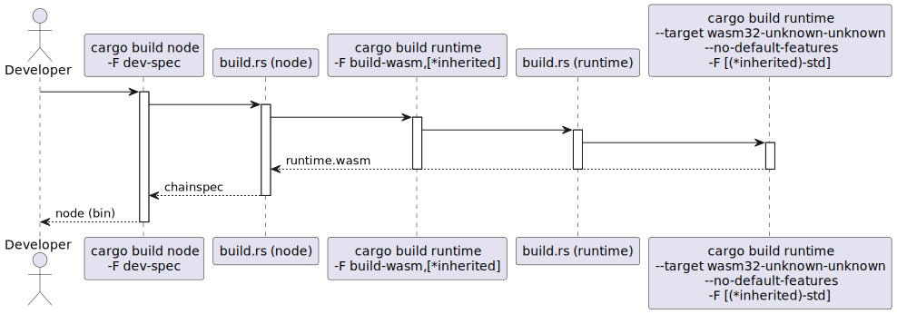

# Node build process

Both `mosaic-chain-node` and `mosaic-testnet-solo-node`
may optionally include a development chain-spec if the `dev-spec` feature is enabled during compilation.

The chainspec depends on the runtime code (wasm) and some configuration that determines the genesis state.

The runtime and chainspec generation process is more complicated than usual
and we utilize our own tool (`runtime-generator`) to facilitate generating different profiles.

The node implementations include `runtime-generator` as a build dependency and use it to generate the development chainspec when required in their build script.

The diagram below illustrates the resulting process:



Note the `[*inherited]` notation. When we build our nodes
with the `try-runtime` and/or `runtime-benchmarks` features on, these features are passed down to the command building the actual wasm binary.

Also note, that anything right from `build.rs (node)` on the diagram is applicable when using `runtime-generator` from the commanline as well.

`runtime-generator` supports two ways of building the runtime.

1. Using the locally installed (native) toolchain.

 Example:

 ```
 ./target/release/runtime-generator native build solo-local
 ```

 We use the native toolchain in node build scripts and when generating throw-away chainspecs.

2. Using the `srtool` docker image for deterministic builds

 Example:

 ```
 ./target/release/runtime-generator srtool pull
 ./target/release/runtime-generator srtool build solo-local
 ```
 We use `srtool` when generating a chainspec for deployment and distribution.
